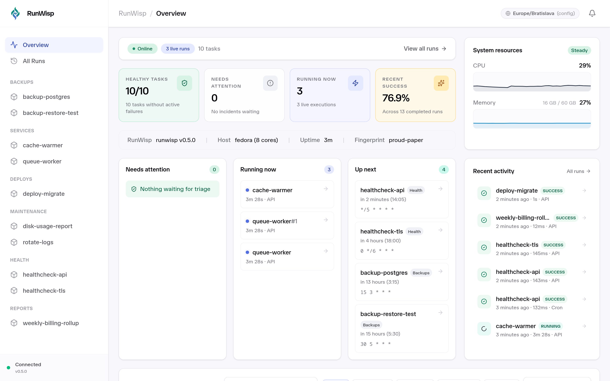

<div align="center">


# RunWisp

**See what ran, when, why it failed, and what it printed.**

The open-source, self-hosted cron job manager and process supervisor — with a built-in web dashboard, terminal UI, and REST API. One static Go binary, zero runtime dependencies.

[runwisp.com](https://runwisp.com) · [Documentation](https://docs.runwisp.com) · [Install](#install) · [Quick Start](#quick-start) · [Why RunWisp](#why-runwisp)

[](LICENSE)
[](https://github.com/runwisp/runwisp/releases)
[](https://github.com/runwisp/runwisp/actions/workflows/ci.yml)
[](https://sonarcloud.io/summary/new_code?id=runwisp_runwisp)
[](https://github.com/runwisp/runwisp)

</div>

---

**RunWisp** is a single-binary replacement for `crond` and `supervisord`. If you've ever SSH'd into a server at 3 AM to figure out _why_ a cron job silently failed, RunWisp is for you.

Define your scheduled jobs — database backups, health checks, log rotation, ETL scripts — and long-running services like queue workers and background daemons in one `runwisp.toml` file. Every run is captured: exit code, duration, timestamps, and full stdout/stderr. You get a built-in web dashboard, terminal UI, REST API, real-time log streaming, and persistent run history out of the box — zero runtime dependencies, embedded SQLite, embedded UI. Runs anywhere a static Go binary runs: Linux, macOS, WSL, Docker, a Raspberry Pi, or a $5 VPS.

<div align="center">

<p><em>Web dashboard: task overview, execution history, and live log streaming, all served by the daemon itself.</em></p>
</div>

---

## Install

One-line installer that drops the `runwisp` binary on your `PATH`:

```bash
curl -fsSL https://get.runwisp.com | sh
```

Or via your favourite package manager:

```bash
bunx runwisp           # try it without installing; runs the prebuilt Go binary via npm
bun add -g runwisp     # or: npm install -g runwisp
```

Prefer manual? Grab a tarball from [GitHub Releases](https://github.com/runwisp/runwisp/releases); assets are named `runwisp-{linux,darwin}-{x64,arm64}.tar.gz` with a matching `checksums-sha256.txt`. **Supported platforms:** Linux, macOS, WSL (x86_64 and arm64).

---

## Quick Start

**1. Create `runwisp.toml`:**

```toml
[tasks.backup-db]
cron       = "0 2 * * *"   # every night at 2 AM
jitter     = "30m"         # if the 2 AM crowd piles up, take turns — slip up to 30 min, never stampede
on_overlap = "skip"        # don't stack if the previous run is still going
keep_runs  = 30
run = "pg_dump mydb | gzip > /backups/mydb-$(date +%F).sql.gz"

[tasks.health-check]
cron = "*/5 * * * *"
run  = "curl -sf https://myapp.example.com/health || exit 1"

[services.worker]
instances    = 3              # keep three replicas always running
env          = { NODE_ENV = "production" }   # visible in the UI
secrets_file = "/etc/runwisp/worker.env"     # never shown in the API/UI
run          = "node /app/worker.js"
```

`[tasks.*]` are scheduled or manually triggered jobs. `[services.*]` are always-on processes that RunWisp keeps alive with exponential restart backoff; each replica is its own visible run with its own exit code, duration, and captured logs.

Already running things under `docker compose`? Add `[compose.myapp]` next to your `docker-compose.yml` and every service in it becomes an observable RunWisp service — logs, restart policies, notifications, trigger/stop — without rewriting your compose file. See [`[compose.*]`](https://docs.runwisp.com/configuration/compose/).

Already on crond or supervisord? `runwisp import cron /etc/crontab` (or `runwisp import supervisord`) converts an existing config into an annotated `runwisp.toml` to start from, with inline `# TODO`s for anything that needs a human. See [Migrating from cron](https://docs.runwisp.com/recipes/migrating-from-cron/).

**2. Run it:**

```bash
runwisp
```

That's it. `runwisp` starts the daemon and drops you straight into the **terminal UI**: task list, live logs, run history, one-click triggering. The web dashboard URL appears on the TUI's Home page, secured by an auto-generated password (press `Enter` to copy it). Want headless? `runwisp daemon`. Want your own password? Set `RUNWISP_PASSWORD`. No login wall for local dev (e.g. Docker)? Set [`RUNWISP_NO_AUTH=1`](https://docs.runwisp.com/operations/auth/#running-without-a-password). Want it to survive reboot? `runwisp service install`.

Full configuration reference, REST API docs, and operational guides live at **[docs.runwisp.com](https://docs.runwisp.com)**.

---

## Why RunWisp

| If you currently use…         | The pain                                                            | RunWisp fixes it by…                                                                                                 |
| ----------------------------- | ------------------------------------------------------------------- | -------------------------------------------------------------------------------------------------------------------- |
| **crond / crontab**           | Silent failures, no history, no output capture, no overlap handling | Persisting every run (exit code, duration, stdout/stderr) to embedded SQLite: browsable, streamable, and searchable. |
| **systemd timers**            | One `.timer` + one `.service` per job, OS-locked, painful in Docker | One TOML file. Cross-platform. Same binary on your MacBook, in CI, and in production.                                |
| **supervisord**               | No scheduling, Python install, dated XML-RPC API, basic web UI      | Cron scheduling and process supervision in one binary. Modern REST API. Svelte dashboard. Built-in log rotation.     |
| **supercronic / Ofelia**      | Logs to stdout only; no history, no UI                              | Same Docker-friendly footprint, plus per-run logs, persistent history, live streaming, and one-click re-trigger.     |
| **Airflow / Cronicle / Dagu** | Heavy, multi-process, requires an external DB and a team to operate | Single binary. ~25 MB RAM idle. No external DB. No ops team. Running in five minutes.                                |

---

## Features

**Scheduling & execution**

- Standard cron expressions with per-task concurrency policies (`queue` · `skip` · `terminate`)
- Long-running services with one or more `instances`, exponential restart backoff, crash recovery, graceful shutdown
- Retries with configurable backoff (`constant` · `linear` · `exponential`)
- Per-task timeouts with automatic kill on deadline
- Catchup policies for missed runs (`latest` · `all` · `skip`)
- Per-execution parameters: declare env vars, args, options, and flags a task accepts, then supply values at trigger time from the UI, TUI, or API — passed as inert argv, never spliced into the shell

**Observability**

- Real-time stdout/stderr streaming over SSE, viewable in the web UI and TUI
- Every run recorded in SQLite with exit code, duration, and timestamps
- Built-in per-task log rotation with overflow policies (`drop_new` · `drop_old` · `kill_task`)
- Failure alerts to Slack, Discord, Telegram, email (SMTP), generic webhooks, or the in-app inbox — routed per task with `notify_on_failure` · `notify_on_success` · `notify_on_missed`

**Interfaces**

- **Web dashboard**: Svelte 5 SPA with dark mode, embedded in the binary
- **Terminal UI**: full Bubbletea TUI for headless servers and SSH sessions
- **REST API**: authenticated endpoints for triggering, listing, and managing tasks

**Operations**

- Single Go binary, zero runtime dependencies. No Python, no Node.js, no external database.
- ~25 MB RAM idle, happy on a $5 VPS, a Raspberry Pi, or alongside your real workload
- Crash-safe: `kill -9` and power loss are recoverable; in-flight runs are marked **interrupted** on restart, never silently lost
- Local-first, offline-complete. No signup, no telemetry, no account required.
- TOML configuration: one file, version-controllable, reviewable in pull requests
- Live config reload via `runwisp reload` or `SIGHUP` — pick up `runwisp.toml` edits without a restart; validate-first, so a bad edit leaves the running task set untouched

<div align="center">

<p><em>Terminal UI: full task management from your terminal, over SSH, without leaving the session.</em></p>
</div>

---

## How RunWisp compares

|                      | crond                | systemd timers     | supervisord    | **RunWisp**                           |
| -------------------- | -------------------- | ------------------ | -------------- | ------------------------------------- |
| Cron scheduling      | Yes                  | Yes                | No             | **Yes**                               |
| Process supervision  | No                   | Yes                | Yes            | **Yes**                               |
| Web dashboard        | No                   | No                 | Basic HTML     | **Yes (Svelte SPA)**                  |
| Terminal UI          | No                   | No                 | No             | **Yes (Bubbletea)**                   |
| REST API             | No                   | D-Bus              | XML-RPC        | **REST + JWT**                        |
| Live log streaming   | No                   | `journalctl -f`    | Tail only      | **SSE**                               |
| Concurrency policies | No                   | Overlap prevention | No             | **Queue · skip · terminate**          |
| Failure alerts       | No                   | `OnFailure=` unit  | Event listener | **Slack · Discord · email · webhook** |
| Log rotation         | External (logrotate) | journald           | Built-in       | **Built-in, per-task**                |
| Execution history    | No                   | `journalctl`       | No             | **SQLite, browsable in UI**           |
| Runtime dependencies | libc                 | systemd            | Python         | **None**                              |
| Config               | crontab syntax       | INI unit files     | INI files      | **One TOML file**                     |

---

## Documentation

Full user and operator documentation lives at **[docs.runwisp.com](https://docs.runwisp.com)**: installation, the complete `runwisp.toml` schema, scheduling and concurrency policies, retries, log rotation, the REST API, and operational guides.

- [Changelog](CHANGELOG.md) - recent changes and version history
- [Contributing](CONTRIBUTING.md) - development setup and contribution guidelines
- [Security Policy](SECURITY.md) - responsible disclosure
- [Issue tracker](https://github.com/runwisp/runwisp/issues) - bug reports and feature requests

> **Status: pre-1.0, moving fast.** The single-machine essentials are here — scheduling, supervision, live logs, and persistent run history. But RunWisp is young software, so treat it that way: pin a version, keep backups of anything you'd hate to lose, and skim [CHANGELOG.md](CHANGELOG.md) before upgrading, since pre-1.0 bumps can ship breaking changes and reset run history. A few things (like the cloud control plane) aren't here yet. Kick the tyres and tell us what breaks.

---

## License

Apache-2.0. Use it however you want: personal projects, startups, enterprises. No CLA, no dual-licensing, no strings attached. See [LICENSE](LICENSE).

---

<div align="center">

**RunWisp** - cron and supervisord, replaced.

[runwisp.com](https://runwisp.com) · [Documentation](https://docs.runwisp.com) · [Releases](https://github.com/runwisp/runwisp/releases) · [Report a bug](https://github.com/runwisp/runwisp/issues)

</div>
