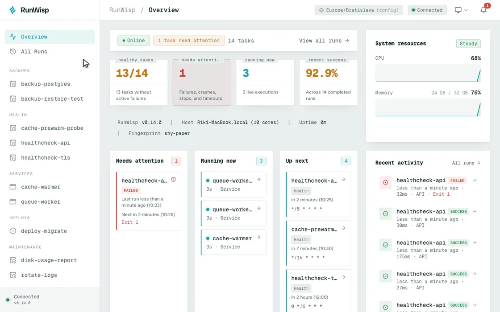

<div align="center">


# RunWisp

**See what ran, when, why it failed, and what it printed.**

RunWisp is an open-source, self-hosted cron job manager and process supervisor. It ships as a single Go binary with a built-in web dashboard, terminal UI, and REST API.

[runwisp.com](https://runwisp.com) · [Documentation](https://docs.runwisp.com) · [Install](#install) · [Quick Start](#quick-start) · [Compare](#runwisp-vs-cron-systemd-timers-and-supervisord)

[](LICENSE)
[](https://github.com/runwisp/runwisp/releases)
[](https://github.com/runwisp/runwisp/actions/workflows/ci.yml)
[](https://sonarcloud.io/component_measures?id=runwisp_runwisp&metric=coverage)
[](https://sonarcloud.io/summary/new_code?id=runwisp_runwisp)
[](https://github.com/runwisp/runwisp)

</div>

---

RunWisp replaces `crond` and `supervisord` when you want scheduled jobs and long-running services in one place. You describe both in `runwisp.toml`; the daemon runs them without needing Python, Node.js or an external database.

Every run leaves evidence behind: its exit code, duration, timestamps, and stdout/stderr. You can inspect history, follow logs, and trigger or stop tasks from the web dashboard, terminal UI, or REST API. Task definitions stay on disk in TOML.

<div align="center">

<p><em>Trigger a run, follow its output, and inspect failures from the built-in dashboard.</em></p>
</div>

## Install

Install the latest binary on your `PATH`:

```bash
curl -fsSL https://get.runwisp.com | sh
```

You can also use the npm package, which runs the prebuilt Go binary:

```bash
bunx runwisp
bun add -g runwisp     # or: npm install -g runwisp
```

Tarballs are available from [GitHub Releases](https://github.com/runwisp/runwisp/releases). For Docker:

```bash
docker run -d --name runwisp -p 9477:9477 \
  -e RUNWISP_PASSWORD=change-me \
  -v ./runwisp.toml:/etc/runwisp/runwisp.toml:ro \
  -v runwisp-data:/var/lib/runwisp \
  runwisp/runwisp:latest
```

The image supports amd64 and arm64, with Alpine and Debian variants. See the [Docker guide](https://docs.runwisp.com/getting-started/docker/) for tags, environment variables, and volumes.

## Quick Start

Run:

```bash
runwisp
```

If the current directory has no `runwisp.toml`, RunWisp offers to create an example config file. Press `Enter` and it will write an example task, start the daemon, and open the terminal UI. The Home page shows the web dashboard URL and a generated password; press `Enter` on the password row to copy it.

Set `RUNWISP_PASSWORD` env variable if you want to choose the password yourself. For a trusted local setup, [`RUNWISP_AUTH=off`](https://docs.runwisp.com/operations/auth/#running-without-a-password) disables authentication explicitly.

> **Running headless?** Use `runwisp daemon` in cron, systemd, Docker, CI, or a piped SSH session. It doesn't prompt, and a missing config exits non-zero. To start RunWisp after a reboot, use `runwisp service install` for systemd or launchd.

Replace the starter task with your own jobs and services:

```toml
[tasks.backup-db]
cron       = "0 2 * * *"
jitter     = "30m"  # delay by up to 30 mins if other jobs are running
on_overlap = "kill" # if yesterday's job is still running, kill it
keep_runs  = 30     # remove older runs
run = "pg_dump mydb | gzip > /backups/mydb-$(date +%F).sql.gz"

[services.worker]
instances    = 3                           # keep three copies running
env          = { NODE_ENV = "production" } # shown in API/UI
secrets_file = "/etc/runwisp/worker.env"   # never leaked to the API/UI
run          = "node /app/worker.js"
```

## Moving from cron, supervisord, or Docker Compose

RunWisp can start from the configuration you already have:

- [Take over from cron](https://docs.runwisp.com/coming-from/cron/).
- [Import crontab](https://docs.runwisp.com/coming-from/crontabs/).
- [Import supervisord](https://docs.runwisp.com/coming-from/supervisord/)
- [Import docker compose](https://docs.runwisp.com/coming-from/supervisord/).

<div align="center">

<p><em>The terminal UI keeps task status, logs, history, and controls in the SSH session.</em></p>
</div>

## Features

**Scheduling and supervision**

- Standard cron schedules, missed-run handling, retries, timeouts, and `queue`, `skip`, or `kill` overlap policies
- Long-running services with multiple instances, restart backoff, crash recovery, and graceful shutdown. 500k lines/day, for months without interruption, RunWisp can handle it and stream it to you.
- Typed parameters for manual runs, passed as arguments or environment variables through UI/API/CLI

**Run history and logs**

- Exit code, duration, timestamps, and status persisted in embedded SQLite
- Live stdout/stderr streaming in the web UI and terminal UI
- Per-task log rotation and failure notifications through Slack, Discord, Telegram, email, webhooks, or the in-app inbox

**Day-to-day operation**

- One binary with the Svelte web dashboard and SQLite embedded
- TOML configuration that can be versioned and reviewed like code
- Validate-first reloads, recoverable state after a crash or power loss, and interrupted-run reporting on restart
- Local-first operation with no signup, account, telemetry, or required network connection

## Comparison

|                      | crond                | systemd timers     | supervisord    | **RunWisp**                                  |
| -------------------- | -------------------- | ------------------ | -------------- | -------------------------------------------- |
| Cron scheduling      | Yes                  | Yes                | No             | **Yes**                                      |
| Process supervision  | No                   | Yes                | Yes            | **Yes**                                      |
| Web dashboard        | No                   | No                 | Basic HTML     | **Built in**                                 |
| Terminal UI          | No                   | No                 | No             | **Built in**                                 |
| Remote interface     | No                   | D-Bus              | XML-RPC        | **REST API**                                 |
| Live log streaming   | No                   | `journalctl -f`    | Tail only      | **Web UI, TUI, and SSE**                     |
| Concurrency policies | No                   | Overlap prevention | No             | **Queue, skip, or kill**                     |
| Failure alerts       | No                   | `OnFailure=` unit  | Event listener | **Slack, Discord, Telegram, email, webhook** |
| Execution history    | No                   | `journalctl`       | No             | **SQLite, browsable in the UI**              |
| Runtime dependencies | libc                 | systemd            | Python         | **None**                                     |
| Configuration        | crontab              | Unit files         | INI files      | **One TOML file**                            |

The API and user interfaces can inspect tasks and trigger or stop them. **Task definitions cannot be modified remotely.** `runwisp.toml` remains the source of truth.

## Links

- [Documentation](https://docs.runwisp.com) — installation, configuration, REST API, and operations
- [Changelog](CHANGELOG.md) — recent changes and version history
- [Contributing](CONTRIBUTING.md) — development setup and contribution guidelines
- [Security policy](SECURITY.md) — responsible disclosure
- [Issue tracker](https://github.com/runwisp/runwisp/issues) — bug reports and feature requests

## Development transparency

RunWisp is built by PoppyCake, s.r.o., led by Richard Popelis, a software engineer with 15 years of professional experience. PoppyCake owns the product design, APIs, configuration model, architecture, and release decisions. Generative AI helps with implementation, tests, documentation, and review; generated work is reviewed before release.

## License

The RunWisp daemon and web UI are licensed under GPL-3.0-or-later. Basically, do what you want but if you distribute a modified version, you must keep it open under the same license. See [LICENSE](LICENSE).

Shared libraries under `packages/` use Apache-2.0 instead. See [LICENSE-APACHE](LICENSE-APACHE) and the license file in each package.

---

<div align="center">

[runwisp.com](https://runwisp.com) · [Documentation](https://docs.runwisp.com) · [Releases](https://github.com/runwisp/runwisp/releases) · [Report a bug](https://github.com/runwisp/runwisp/issues)

</div>
