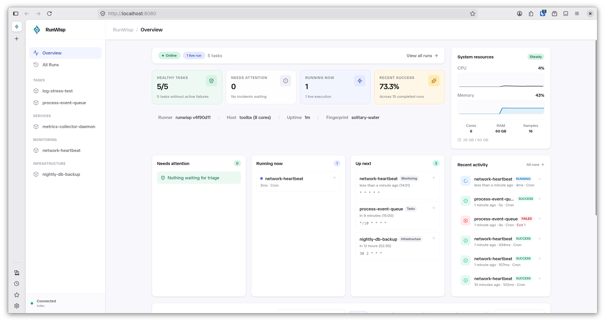
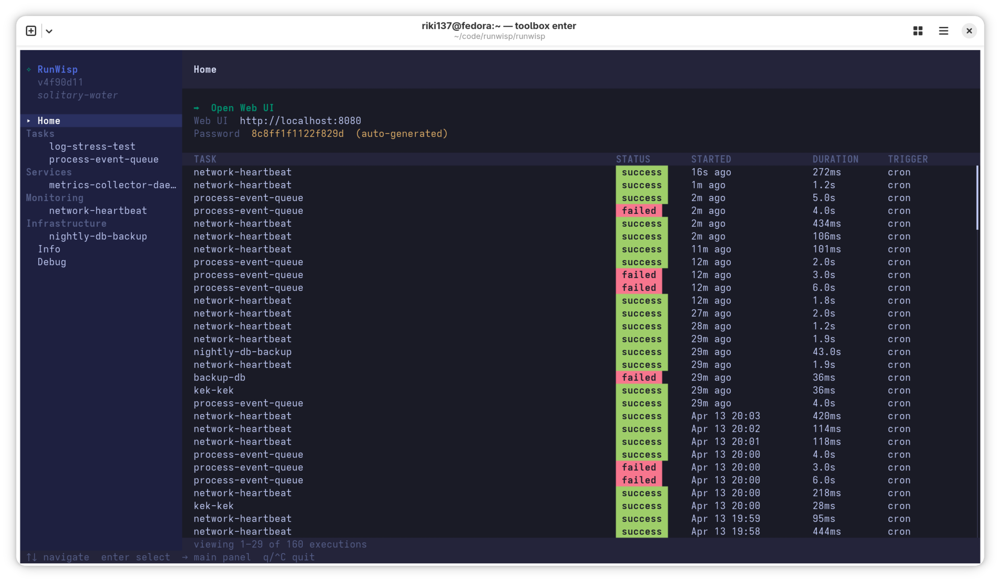

<div align="center">


# RunWisp

### Stop babysitting cron jobs. Start shipping.

**The open-source cron replacement and process supervisor with a built-in web dashboard.**

One binary. One TOML file. Zero runtime dependencies. Full visibility into every run.

[](LICENSE)
[](https://github.com/runwisp/runwisp/releases)
[](https://github.com/runwisp/runwisp/actions/workflows/ci.yml)
[](https://goreportcard.com/report/github.com/runwisp/runwisp)
[](https://github.com/runwisp/runwisp)

[Quick Start](#quick-start) · [Why RunWisp?](#why-runwisp) · [Features](#features) · [Comparison](#comparison-with-crond-systemd-timers-and-supervisord) · [Docs](https://docs.runwisp.com)

</div>

---

> **TL;DR** — RunWisp is a single-binary replacement for `crond`, `crontab`, and `supervisord`. Define your cron jobs and long-running processes in TOML, then get a web dashboard, terminal UI, REST API, real-time log streaming, and persistent execution history out of the box. No Python, no Node.js, no external database. Runs anywhere a static Go binary runs — VPS, Raspberry Pi, Docker, bare metal.

> [!NOTE]
> **Status: pre-1.0** — RunWisp runs scheduled jobs and small services on a single machine today. The TOML schema is still settling; expect breaking changes between minor versions until 1.0 — every change ships in [CHANGELOG.md](CHANGELOG.md). Several roadmap items (cloud control plane, log search, reload-without-restart) aren't here yet — see the [roadmap](https://docs.runwisp.com/roadmap/).

---

## Why RunWisp?

If you've ever SSH'd into a server at 3 AM to figure out _why_ a cron job silently failed, RunWisp is for you. It's purpose-built for the solo developer, the small ops team, and the DevOps engineer whose options today are "edit `crontab` over SSH" or "stand up Airflow." It meets you in the middle — a real cron-job manager with observability, designed for one machine you actually own.

- **`crond` is invisible.** Plain cron has no execution history, no log viewer, no failure notifications, and no concept of overlapping runs. RunWisp captures stdout/stderr per run, persists exit codes and durations to embedded SQLite, and shows you the last hundred runs in a browsable UI.
- **`systemd` timers are tedious and OS-locked.** Writing `.timer` and `.service` files for every job is painful, and `journalctl` doesn't work in Docker or on macOS. RunWisp provides scheduling, concurrency control (queue / skip / terminate), and logging in a single cross-platform `runwisp.toml`.
- **Containerized cron lacks observability.** Lightweight runners like `supercronic` solve the container-cron execution problem but dump everything to `stdout`. RunWisp gives you per-task log retention, persistent run history, live log streaming, and one-click re-triggering — without leaving the container.
- **End the DevOps translation game.** Developers define schedules, retries, and limits in a single `runwisp.toml` checked into the repo. Because the same binary handles scheduling across a local MacBook, CI, and production, dev environments match prod exactly. No more "it works on my machine because I have a different crontab."

---

## Web Dashboard

A clean, modern Svelte dashboard ships inside the binary. Task status, execution history, live log streaming, one-click triggering, and dark mode — all without installing anything else. No Docker, no Node.js, no signup, no telemetry.

<div align="center">

<p><em>Web dashboard — task overview, execution history, and live log streaming</em></p>
</div>

## Terminal UI

For headless servers, when SSH is your shell, or when you just prefer the terminal. A full interactive TUI built with Bubbletea — browse tasks, view live logs, trigger runs, all without leaving your terminal session.

<div align="center">

<p><em>Terminal UI — full task management from your terminal</em></p>
</div>

---

## Quick Start

**Supported platforms:** Linux, macOS, and WSL — both x86_64 and arm64. Native Windows is not supported.

**1. Install** — pick whichever fits your workflow:

```bash
# Recommended: one-liner installer — puts `runwisp` on your PATH
curl -fsSL https://get.runwisp.com | sh
```

```bash
# No install — run straight from npm (launches the prebuilt Go binary;
# RunWisp itself is not a Node.js app)
bunx runwisp     # or: npx runwisp
```

```bash
# Global install via Bun or npm
bun add -g runwisp     # or: npm install -g runwisp
```

Prefer manual? Grab a tarball from [Releases](https://github.com/runwisp/runwisp/releases) — assets are named `runwisp-{linux,darwin}-{x64,arm64}.tar.gz` and a matching `checksums-sha256.txt` is published alongside them.

**2. Define your tasks** in `runwisp.toml`:

```toml
[tasks.backup-db]
cron       = "0 2 * * *"  # every night at 2 AM
on_overlap = "skip"       # don't stack if the previous run is still going
keep_runs  = 30
run = "pg_dump mydb | gzip > /backups/mydb-$(date +%F).sql.gz"

[tasks.health-check]
cron = "*/5 * * * *"       # every 5 minutes
run  = "curl -sf https://myapp.example.com/health || exit 1"

[services.worker]
instances = 3              # keep three replicas always running
run       = "node /app/worker.js"
```

`[tasks.*]` is for scheduled and manual jobs; `[services.*]` is for always-on processes that RunWisp keeps alive with exponential restart backoff. Each replica of a service runs as its own visible run, with its own exit code, duration, and captured logs.

**3. Start RunWisp:**

```bash
runwisp
```

**4. You're now in the Terminal UI.** `runwisp` spawns the daemon in the background and attaches an interactive TUI — task list, live log streaming, run history, one-click triggering. **On first run** the TUI prints the auto-generated Web UI password exactly once — copy it then, the daemon stores only an SRP verifier and cannot recover it afterwards. Want headless instead? Use `runwisp daemon`.

**5. Pin a password or change the bind address (optional).** Set `RUNWISP_PASSWORD` to use your own password instead of the auto-generated one, or pass `--host` / `--port` to change where the daemon listens. For at-rest encryption of secrets (verifier, JWT signing key) set `RUNWISP_DATA_KEY=$(runwisp keygen)` — see [Auth](https://docs.runwisp.com/operations/auth/) for details.

That's it — your tasks are scheduled, supervised, and observable through the Web UI, TUI, and REST API.

#### Useful next steps

```bash
runwisp list                # show configured tasks and their schedules
runwisp exec backup-db      # run a task in this CLI process (no daemon), stream output
runwisp run-task backup-db  # trigger a run via the running daemon's REST API
runwisp status              # check whether a daemon is alive
runwisp tui                 # attach a fresh TUI to an already-running daemon
runwisp validate            # parse and check runwisp.toml without starting anything
```

Starting `runwisp` in an empty directory prompts to scaffold a minimal
`runwisp.toml` for you — press `Enter` and the daemon writes a starter
file before booting the TUI.

---

## Features

### Scheduling & Execution

- **Cron scheduling** — standard cron expressions, per-task concurrency policies (`queue`, `skip`, `terminate`)
- **Process supervision** — long-running services with one or more `instances`, exponential restart backoff, crash recovery, and graceful shutdown
- **Retries with backoff** — configurable `retry_attempts`, `retry_delay`, and `retry_backoff` (`constant` / `linear` / `exponential`, shared with services' `restart_backoff`)
- **Timeouts** — per-task `timeout` enforcement, automatic kill on deadline
- **Catchup policies** — configurable missed-run behaviour (`latest`, `all`, `skip`) via `catch_up`

### Observability

- **Real-time log streaming** — live stdout/stderr over SSE, viewable in the web UI and TUI
- **Execution history** — every run is recorded in SQLite with exit code, duration, start/end timestamps
- **Log rotation** — per-task `log_max_size` with overflow policies (`drop_new`, `drop_old`, `kill_task`)

### Interfaces

- **Web dashboard** — Svelte SPA with task status, run history, log viewer, one-click triggering, dark mode
- **Terminal UI** — interactive Bubbletea TUI for headless servers and SSH sessions
- **REST API** — authenticated endpoints for triggering, listing, and managing tasks programmatically

### Operations

- **Single binary, zero runtime dependencies** — compiled Go with embedded SQLite and embedded web UI; no Python, no Node.js, no external database
- **Around 25 MB RAM at idle** — designed to run comfortably on a VPS, a Raspberry Pi, or alongside your real workload
- **Crash-safe state** — `kill -9` and power loss are recoverable; in-flight runs are marked **interrupted** on restart and never silently lost
- **Local-first, offline-complete** — the daemon runs fully offline; no signup, no account, no telemetry
- **TOML configuration** — one file, version-controllable, reviewable in pull requests
- **Disk safeguards** — `storage.max_size` and `storage.min_free_space` limits to prevent runaway log growth

---

## Comparison with crond, systemd timers, and supervisord

|                         | crond                | systemd timers     | supervisord | **RunWisp**                 |
| ----------------------- | -------------------- | ------------------ | ----------- | --------------------------- |
| **Cron scheduling**     | Yes                  | Yes                | No          | **Yes**                     |
| **Process supervision** | No                   | Yes (via units)    | Yes         | **Yes**                     |
| **Web dashboard**       | No                   | No                 | Basic HTML  | **Yes** (Svelte SPA)        |
| **Terminal UI**         | No                   | No                 | No          | **Yes** (Bubbletea)         |
| **REST API**            | No                   | D-Bus              | XML-RPC     | **REST + JWT**              |
| **Live log streaming**  | No                   | `journalctl -f`    | Tail only   | **SSE**                     |
| **Concurrency control** | No                   | Overlap prevention | No          | **Queue, skip, terminate**  |
| **Log rotation**        | External (logrotate) | journald           | Built-in    | **Built-in, per-task**      |
| **Execution history**   | No                   | `journalctl`       | No          | **SQLite, browsable in UI** |
| **Single binary**       | Yes                  | Part of systemd    | No (Python) | **Yes**                     |
| **Config format**       | `crontab` syntax     | INI unit files     | INI files   | **Single TOML file**        |

---

## Alternatives

RunWisp targets the gap between "just use cron" and heavyweight workflow orchestrators. Here's how it compares to other open-source cron job managers and process supervisors:

| Project                                                   | Language | Web UI  | TUI     | Cron    | Supervision | Notes                                                        |
| --------------------------------------------------------- | -------- | ------- | ------- | ------- | ----------- | ------------------------------------------------------------ |
| **crond**                                                 | C        | No      | No      | Yes     | No          | The classic. No visibility into task history or output.      |
| **systemd timers**                                        | C        | No      | No      | Yes     | Yes         | Powerful, but OS-locked and requires two root files per task.|
| **supervisord**                                           | Python   | Basic   | No      | No      | Yes         | Mature process supervisor. No cron scheduling.               |
| **[Ofelia](https://github.com/mcuadros/ofelia)**          | Go       | No      | No      | Yes     | No          | Docker-focused cron. No web UI.                              |
| **[Dagu](https://github.com/dagu-org/dagu)**              | Go       | Yes     | No      | Yes     | No          | DAG-based workflow engine. More complex, aimed at pipelines. |
| **[Cronicle](https://github.com/jhuckaby/Cronicle)**      | Node.js  | Yes     | No      | Yes     | No          | Feature-rich, multi-server. Heavier footprint (Node.js).     |
| **[Supercronic](https://github.com/aptible/supercronic)** | Go       | No      | No      | Yes     | No          | Crontab for Docker, but only logs to stdout (no history).    |
| **RunWisp**                                               | Go       | **Yes** | **Yes** | **Yes** | **Yes**     | Single binary, embedded SQLite, web + TUI, ~25 MB RAM idle.  |

If you need DAG pipelines or enterprise-grade orchestration, tools like Dagu, Airflow, or Cronicle may be a better fit. If you want a lightweight, single-binary cron replacement with modern observability, RunWisp is what you're looking for.

---

## Documentation

Full documentation lives at **[docs.runwisp.com](https://docs.runwisp.com)** — installation, the complete `runwisp.toml` schema, scheduling and concurrency policies, log rotation, the REST API, and operational guides.

|                                              |                                      |
| -------------------------------------------- | ------------------------------------ |
| [docs.runwisp.com](https://docs.runwisp.com) | Full user and operator documentation |
| [Changelog](CHANGELOG.md)                    | Recent changes and version history   |
| [Contributing](CONTRIBUTING.md)              | How to contribute                    |
| [Security Policy](SECURITY.md)               | Reporting vulnerabilities            |

---

## Build from Source

```bash
git clone https://github.com/runwisp/runwisp
cd runwisp
bun install
bun run build
bun run test
bun run check
```

Requires Go 1.25+ and Bun.

---

## License

RunWisp is licensed under the [Apache License 2.0](LICENSE). Use it however you want — in personal projects, startups, enterprises. No CLA, no dual-licensing, no strings attached.

---

## Contributing

See [CONTRIBUTING.md](CONTRIBUTING.md) for development setup and guidelines.

## Support

- [GitHub Issues](https://github.com/runwisp/runwisp/issues) — Bug reports and feature requests
- [Security Policy](SECURITY.md) — Responsible disclosure

---

<div align="center">

**RunWisp** — cron and supervisord, replaced.

[Get Started](#quick-start) · [GitHub](https://github.com/runwisp/runwisp) · [Releases](https://github.com/runwisp/runwisp/releases)

</div>
