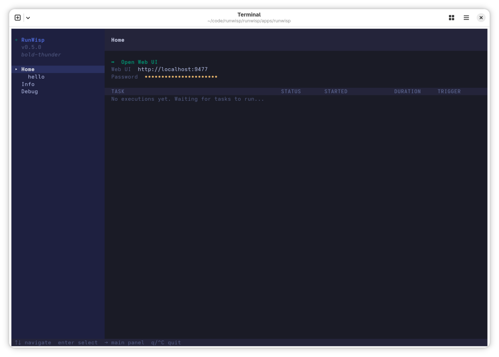

import { Tabs, TabItem, CardGrid, LinkCard } from "@astrojs/starlight/components";

RunWisp is one small Go binary. You list the shell commands you want
to run in a `runwisp.toml`, and RunWisp takes care of the rest —
firing jobs on cron, restarting services when they crash, and
capturing every line of stdout and stderr so you can go back and
look at what happened. There's a TUI in your terminal and a Web UI
in your browser for poking around. No external database, no agent,
no sidecar.

It runs on Linux, macOS, and WSL — on `x86_64` or `arm64`. There's
no native Windows build; if Windows is where you live, run RunWisp
inside WSL.

## 1. Install

Pick whichever channel feels most natural for how you install
software. The binary is statically linked with zero runtime
dependencies, so as soon as it lands on your `PATH`, you're done.

<Tabs syncKey="install-method">
    <TabItem label="Install script" icon="seti:shell">
        Figures out your OS and arch, grabs the right release, checks
        the SHA-256, and puts `runwisp` on your `PATH`.

        ```bash
        curl -fsSL https://get.runwisp.com | sh
        ```
    </TabItem>
    <TabItem label="Bun / npm" icon="seti:javascript">
        Got Bun or Node already? The npm package is a tiny shim that
        downloads the matching native binary the first time you run it.

        Want to try it without a global install?

        <Tabs syncKey="npm">
        <TabItem label="Bun">
        ```bash
        bunx runwisp
        ```
        </TabItem>
        <TabItem label="npm">
        ```bash
        npx runwisp
        ```
        </TabItem>
        </Tabs>

        That's the tidiest option for CI runners and other
        throwaway environments. For something that sticks around:

        <Tabs syncKey="npm">
        <TabItem label="Bun">
        ```bash
        bun add -g runwisp
        ```
        </TabItem>
        <TabItem label="npm">
        ```bash
        npm install -g runwisp
        ```
        </TabItem>
        </Tabs>
    </TabItem>
    <TabItem label="tar.gz" icon="download">
        Pick the right `runwisp-{linux,darwin}-{x64,arm64}.tar.gz`
        off the [GitHub releases page][releases]. There's a
        `checksums-sha256.txt` sitting next to it if you want to
        verify before extracting.

        ```bash
        tar -xzf runwisp-linux-x64.tar.gz
        sudo mv runwisp /usr/local/bin/runwisp
        ```

        [releases]: https://github.com/runwisp/runwisp/releases
    </TabItem>
    <TabItem label="From source" icon="seti:go">
        You'll need Go 1.25+ and Bun.

        ```bash
        git clone https://github.com/runwisp/runwisp
        cd runwisp
        bun install
        bun run build
        ```

        Your binary will be at `apps/runwisp/runwisp`.
    </TabItem>

</Tabs>

## 2. First run

Pick a directory where you'd like your tasks to live — a project
root, your home folder, anywhere you'd happily keep a config file —
and run:

```bash
runwisp
```

The first time, when there's no `runwisp.toml` next to you yet,
RunWisp won't go behind your back. It asks:

```
No runwisp.toml at /home/user/myproject.
Create a starter with one example task? [Y/n]
```

Hit <kbd>Enter</kbd>. RunWisp writes a starter file, fires up its
daemon in the background, and drops you into the **TUI**.



The Home page hands you two things worth remembering: the **Web UI
URL** (`http://localhost:9477` out of the box) and an
**auto-generated password** for logging in from the browser. You
won't need the password to open the dashboard from this TUI — it
shoves a logged-in session straight at your browser. But if you'll
ever want to hit the dashboard from another machine, or from a
fresh browser, highlight the password row now and press

<kbd>Enter</kbd> to copy it to the clipboard.

Here's the `runwisp.toml` that just got written: one task you can
actually run, plus a couple of commented hints showing the most
common next steps.

```toml
# runwisp.toml
# Docs: https://docs.runwisp.com/configuration/overview/

[tasks.hello]
description = "Example task. Trigger it from the TUI (press r) or the Web UI."
run = "echo hello from runwisp"

# Schedule a task with cron:
# [tasks.heartbeat]
# cron = "* * * * *"
# run  = "date"

# Long-running service (auto-restart, supports replicas):
# [services.worker]
# instances = 1
# run       = "node ./worker.js"
```

:::tip[Headless boxes]
On a host with no terminal — cron, systemd, Docker — start the
daemon with `runwisp daemon` instead of bare `runwisp`. That skips
the scaffold prompt entirely and exits with a non-zero code if
there's no `runwisp.toml`. Missing config fails loudly in your
init scripts instead of hanging on a prompt nobody can answer.
:::

## 3. Run the example task

There are three places you can fire off `hello`. They all hit the
same daemon and land in the same history — pick whichever is closest
to where your hands already are.

<Tabs syncKey="surface">
    <TabItem label="Web UI" icon="laptop">
        Open the dashboard (step 4 walks through that the first time
        around), click `hello` in the sidebar, and hit **Run Task**.
        `hello from runwisp` streams into the log pane live, and the
        run shows up in the task's history.
    </TabItem>
    <TabItem label="TUI" icon="seti:shell">
        The sidebar on the left lists every task and service in your
        config. Press <kbd>←</kbd> (or just click) to focus the
        sidebar, arrow down to `hello`, and hit <kbd>r</kbd>. The
        exec view opens and `hello from runwisp` streams in live.

        

        From here, <kbd>r</kbd> kicks off another run, <kbd>s</kbd>
        stops one that's still going, <kbd>d</kbd> downloads the
        whole log, <kbd>f</kbd> blows the pane up to fullscreen, and
        <kbd>Esc</kbd> closes the view and hands focus back to the
        sidebar. Older runs sit in the list above the active one —
        scroll up to replay any of them.
    </TabItem>
    <TabItem label="REST API" icon="cloud-download">
        From a shell:

        ```bash
        runwisp exec hello
        ```

        `runwisp exec` pipes stdout and stderr straight to your
        terminal and exits with the run's own exit code, so it slots
        cleanly into a script or a one-off command. If a daemon's
        running, it goes through the REST API. If not, it just runs
        the task in-process from `runwisp.toml`.
    </TabItem>

</Tabs>

## 4. Open the Web UI

Press <kbd>Esc</kbd> to leave the exec view, arrow back up to
`Home` in the sidebar, then highlight `⮕  Open Web UI` on the
Home page and hit <kbd>Enter</kbd>. Your default browser opens the
dashboard, already logged in. Behind the scenes, the TUI mints a
single-use launch ticket and hands it to the browser, so your
password never travels through the URL. On a host without a
browser, the TUI just prints the URL — open it from another
machine and sign in with the password you copied in step 2.


Two knobs worth knowing while you're here:

- Set `RUNWISP_PASSWORD` to pick your own password instead of the
  generated one. The daemon reads it in memory only, never writes
  it to disk, so it plays nicely with Docker secrets and systemd's
  `LoadCredential`.
- Use `--host` and `--port` to move the dashboard somewhere else.
  Defaults are `127.0.0.1` and `9477` — loopback only — which is
  almost always what you want.

## 5. Make it yours

That's the whole loop. Now swap `[tasks.hello]` out for whatever
you actually came here to run. A few patterns to crib from:

```toml
[tasks.backup-db]
cron       = "0 2 * * *"      # nightly at 2 AM
on_overlap = "skip"           # don't pile up if a run is still going
keep_runs  = 30               # keep the last 30 runs on disk
run        = "pg_dump mydb | gzip > /backups/mydb-$(date +%F).sql.gz"

[tasks.health-check]
cron = "*/5 * * * *"          # every five minutes
run  = "curl -sf https://myapp.example.com/health || exit 1"

[services.worker]
instances = 3                 # keep three copies alive at all times
run       = "node /app/worker.js"
```

`[tasks.*]` run on a schedule or on demand and then exit. `[services.*]`
are meant to stay up — when one falls over, RunWisp restarts it,
and it keeps `instances = N` copies running in parallel.

:::note[Tasks and services share names]
A task and a service can't share a name. Define `[tasks.worker]`
_and_ `[services.worker]` in the same file and the daemon will
refuse to start.
:::

RunWisp doesn't watch `runwisp.toml` for changes. When you've
edited the file, quit the TUI with <kbd>Ctrl</kbd>+<kbd>C</kbd>
and run `runwisp` again. Your edits take effect on the next boot.

---

<CardGrid>
    <LinkCard
        title="Web UI tour"
        href="/getting-started/web-ui-tour/"
        description="Every panel in the dashboard and what it shows you."
    />
    <LinkCard
        title="Config overview"
        href="/configuration/overview/"
        description="Every key you can put in runwisp.toml."
    />
    <LinkCard
        title="Concurrency"
        href="/concepts/concurrency/"
        description="What on_overlap actually does when runs collide."
    />
    <LinkCard
        title="OpenMetrics / Prometheus"
        href="/operations/metrics/"
        description="Scrape RunWisp from Prometheus or any OpenMetrics collector."
    />
</CardGrid>
