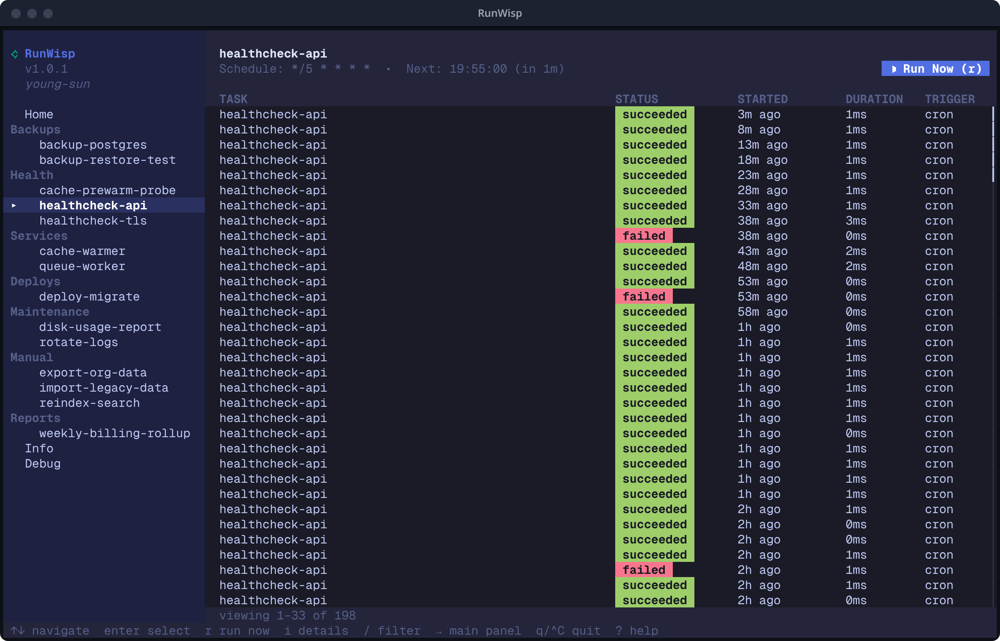
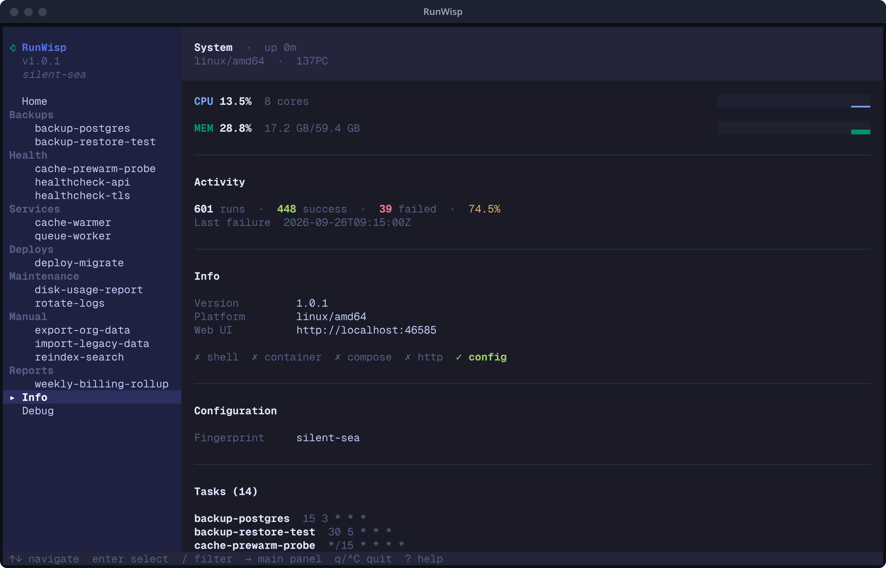
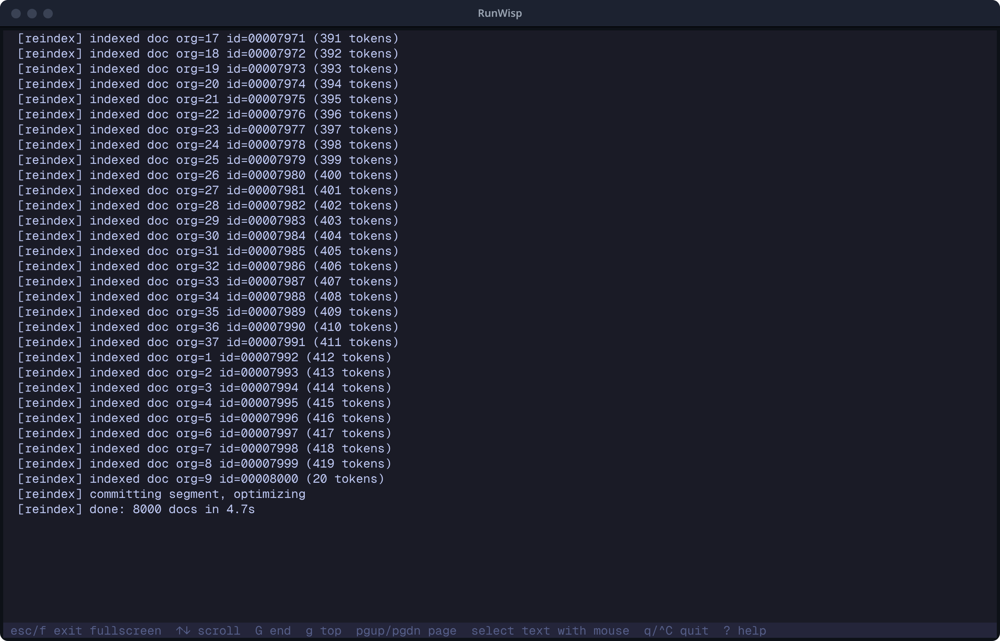
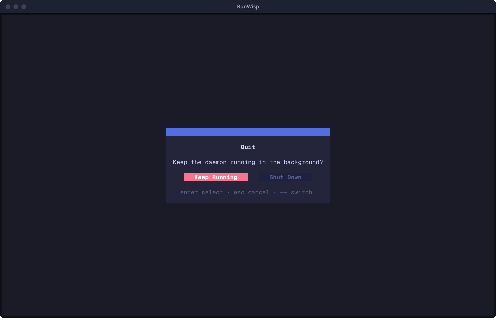

import { CardGrid, LinkCard } from "@astrojs/starlight/components";

The TUI is the keyboard-first half of RunWisp. It runs in a terminal,
connects to a daemon — local over its Unix socket, or remote over
HTTP — and lets you do almost everything the Web UI can —
trigger tasks, follow logs, restart services, browse notifications —
without leaving the shell.

Three ways to start it:

```bash
runwisp                                       # spawn or attach to the local daemon, then attach the TUI
runwisp tui                                   # attach a fresh TUI to a local daemon over its socket
runwisp tui --url https://runwisp.example.com # attach to a remote daemon over HTTP
```

The first form is the everyday one. The second attaches to a daemon
sharing this machine's data dir. The third reaches a daemon you _don't_
share a filesystem with — on another host, in a container — over HTTP;
it logs in with the daemon's password and is covered in
[Authentication](#authentication-briefly) below.

## The Home page (and "Open Web UI")

The TUI lands on **Home**, with focus on the sidebar. Press
whatever key takes you to `▸ ⮕ Open Web UI`:


Press `Enter` and the TUI opens your default browser straight into the
dashboard, already logged in — no copy-pasting the password, no
lockouts from typos. On a server with no browser available, it copies
the URL to your clipboard instead so you can paste it from another
machine.

This works for a remote daemon too (`runwisp tui --url …`): the TUI
mints a short-lived, single-use launch ticket from your authenticated
session and hands it to the browser. One caveat — if you're connected
over **plain `http://` to a non-loopback host**, that ticket would
travel unencrypted, so the TUI asks you to confirm before opening.
Over `https://` (or to loopback) it just opens. The fix for the
warning is the same as for any remote access: put the daemon behind
[TLS](/operations/auth/#reverse-proxies).

The other rows on Home:

- **Web UI** — the daemon's URL. `Enter` copies it to the clipboard.
- **Password** — only shown when the daemon **auto-generated** the
  password on first run. `Enter` copies it.

If you set the password yourself, the password row disappears — the
TUI doesn't have your secret in plaintext form to display, so the
Home page shows only the Open Web UI action and the Web UI URL.

Press `n` while on Home to expand the **notifications panel** at the
top — a scrollable list of in-app notifications with severity dots,
relative timestamps (like "5m ago"), and read-state toggling.

## The shell

There's a **sidebar** on the left, the active view on the right, and a
**help bar** along the bottom that changes to match whatever you're
focused on. You can see all three in the Home screenshot above. The
sidebar starts with three navigation pages (Home / Info / Debug),
then lists your tasks and services grouped by [`group`](/configuration/tasks/#identity--metadata).
The triangle marker `▸` points at whatever's currently showing in the
right pane; the highlighted row is just your cursor — move it around
all you like, nothing happens until you press `Enter`.

## The three pages

### Home

The default view. Two modes:

- **Daemon overview** (no task selected) — the action and field rows
  described above, plus a recent-activity feed across all tasks.
- **Task detail** (a task or service selected from the sidebar) —
  schedule line, a **Run Now** / **Restart** button, and the run
  history for that one task. **Run Now** asks you to confirm before it
  fires. If the task declares
  [parameters](/configuration/tasks/#parameters), **Run Now** opens a
  form instead — fill in the values, then submit to trigger with those
  inputs.



The run list is newest-first — `Home`/`End`/`PgUp`/`PgDn` move you
through the history. Press `f` to filter it by outcome (running /
success / failed); while a filter is active, a banner under the column
header spells out exactly what you're looking at, so you never forget
the list is narrowed. Press `i` on a task to inspect it — a pop-up with
the full definition and its recent health (success rate, last failure).
And when you need to tidy up, `space` selects runs (`a` selects every
run matching the current filter) so you can delete, cancel, or re-run
the lot in one go — the delete is undoable, so a fat-fingered cleanup is
a `u` away from coming back.

### Info

System metrics — CPU and memory sparklines, a run-count summary, and
uptime. This is your "is the daemon healthy right now?" glance without
reaching for a browser.



### Debug

The daemon's own log stream, scrollable in both directions. When
you're attached to a remote daemon, this is also where reconnect
notices show up. Think of it as `journalctl` for the RunWisp process
itself.

## Following a run

`Enter` on a row in the recent-activity list (or in a task's run
history) opens the **run detail view** — log streamed live from the
daemon, line-numbered, with a header showing run ID, start time,
duration, and either a "Retry" button (for ended runs) or a
"Stop" button (for runs that are still going).

The keybindings live in the help bar at the bottom of the screen — the
TUI footer is the source of truth, so look there for whatever's
currently available.


A few keys worth flagging since they aren't obvious:

- `f` — **Fullscreen** the log. Header and line numbers go away;
  only the raw log fills the terminal. Right move for copy-paste.
- `d` — **Download** the run's full log. On a graphical session this
  opens your browser to the download URL; on SSH it copies the URL to
  your clipboard or shows it in a modal you can paste from.
- `r` / `s` — Retry / Stop the run, depending on its current state.
  Both ask for confirmation first, so a stray keypress won't kick off
  (or kill) a run.
- `i` — **Inspect** the run: a pop-up with its exit code, trigger,
  retry lineage, timing, and parameter count. If the run is a retry,
  `Enter` jumps to the attempt it retried.

The log starts in **follow mode** — it auto-scrolls to the tail as
new lines arrive. Manual scrolling up (`↑`, `PgUp`, `g`) **pauses the
follow**; press `G` to jump to the tail and re-engage follow mode.



## The failure path

Prime directive #1 is "nothing silently fails," so it's worth pausing
on **where failures actually show up** in the TUI — exit code, captured
output, and end reason are right up front, not buried somewhere.

Open the run detail view for a failed run and three things tell you
what went wrong before you even scroll:

- **The header status badge** carries the end reason — `failed`,
  `timeout`, `crashed`, `stopped`, `skipped`,
  `log_overflow`, and the rest. Each is a distinct status with its
  own colour, not a generic "error."
- **The exit code** sits in the header next to duration. Sentinel
  codes are real: `-1` is a skipped run that never ran (`on_overlap =
"skip"` rejected it), `-2` is a `crashed` run the daemon was killed
  during. A `timeout` shows whatever exit the OS produced when the
  killed process gave up — typically `143` (SIGTERM) or `137` (SIGKILL).
  Any other positive code is whatever the script returned.
- **The captured log** below is the raw stdout/stderr of the
  attempt — the same bytes the script wrote, line-numbered, with
  ANSI colours rendered. Press `f` to fullscreen it for a copy/paste.
  The layout is the same run-detail view shown above, just with a
  different status badge and exit code in the header.

The sidebar's task entry also reflects status: a task whose **last
run failed** shows up with a coloured marker, so a glance at the
sidebar tells you which tasks need attention without opening each one.

For a task with [retries](/concepts/retries/), every attempt is a separate row in the run
history with its own end reason — attempt 0 might be `failed` and
attempt 1 `success`. Read attempt 0's log to find out why the first
try failed even when the retry recovered; that's the bug-hunting use
of [`keep_runs`](/concepts/logs/#retention-keep_runs-and-keep_for).

If a run never ran at all (`skipped` because of [`on_overlap`](/concepts/concurrency/),
`stopped` because of `on_overlap = "terminate"`), the row is still
there with the policy's reason in the log and a sentinel exit code.
A skipped firing is not silence — it's a row.

## Authentication, briefly

Run the TUI against a local daemon (`runwisp` or `runwisp tui`) and
you're already in — access is gated by the data dir's filesystem
permissions, no password involved.

Connecting over HTTP with `runwisp tui --url …` is different: the
daemon doesn't know who you are, so the TUI logs in with the same
password as the Web UI via the [CHAP handshake][auth]. There's
deliberately **no `--password` flag** — a password on the command line
leaks into your shell history and `ps`. Instead the TUI:

- reads `RUNWISP_PASSWORD` from the environment if it's set (the path
  for scripts and CI), otherwise
- **prompts you without echo**, just once — it then **caches the
  session token** under your user cache dir
  (`$XDG_CACHE_HOME/runwisp/` on Linux, `~/Library/Caches/runwisp/` on
  macOS) and reuses it on the next connect, so you're not retyping the
  password or tripping the daemon's login rate limit.

A daemon started with [`RUNWISP_NO_AUTH=1`](/operations/auth/#running-without-a-password)
needs no password at all — the TUI checks first and connects straight
through. If the password is wrong or you've been rate-limited, the TUI
prints the error and exits rather than landing you on a half-working
screen. See [Auth][auth] for the handshake details.

[auth]: /operations/auth/

## Connection-lost handling

When the daemon goes away (network blip, restart, hard crash), the
TUI retries the connection in the background. The Debug page logs
the reconnect attempt; the rest of the UI keeps showing whatever state
it last had until the daemon comes back and fresh data streams in.
No manual "retry" key needed — when the daemon is back, the TUI
catches up on its own.

## Quitting

Press `q` (or `Ctrl+C`). A two-button dialog asks **"Keep the daemon
running in the background?"** with **Keep Running** and **Shut Down**.
`Esc` closes the dialog without acting.



If you're attached via `runwisp tui` to a daemon you didn't spawn,
**Shut Down** is a no-op — the TUI never stops a daemon it's a guest
of.

## Intentional scope

The TUI is a control surface, not a config editor. It'll trigger, stop,
restart, and observe — but it won't:

- **Edit config.** `runwisp.toml` is the source of truth. Open it in
  your editor, then press `R` in the TUI (or run `runwisp reload`, or
  restart) to pick up changes.
- **Set up notifications.** Routes and notifiers are configured in
  TOML.
- **Create or delete tasks.** Same reason — they live in TOML.
- **Manage users or roles.** RunWisp is single-operator by design.

---

<CardGrid>
    <LinkCard
        title="Web UI tour"
        href="/getting-started/web-ui-tour/"
        description="The same surface in a browser, with mouse and a permanent live tail."
    />
    <LinkCard
        title="Config overview"
        href="/configuration/overview/"
        description="What to put in the TOML the TUI is reading."
    />
    <LinkCard
        title="Operations: auth"
        href="/operations/auth/"
        description="Managing the password and session."
    />
    <LinkCard
        title="Quick start"
        href="/getting-started/quick-start/"
        description="Install RunWisp, scaffold a runwisp.toml, and watch your first task."
    />
</CardGrid>
