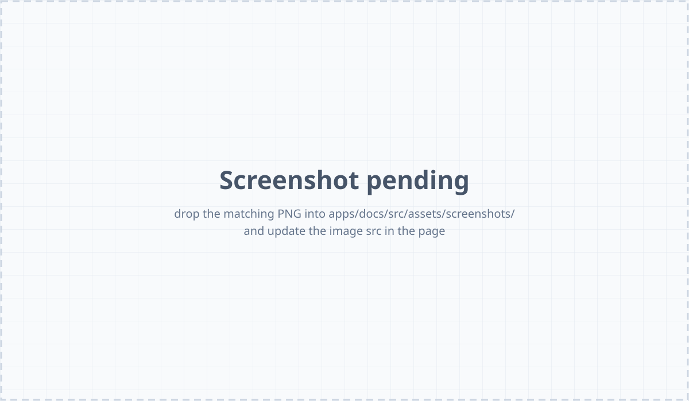

The Web UI is the same dashboard as the [TUI][tui], in your browser
and updated live as runs happen. It lives **inside the daemon
binary** — no separate web server, no CDN, no extra port. Go to
`http://<host>:<port>` (default `http://localhost:9477`) and you're
there.

[tui]: /concepts/tui-tour/

The dashboard is small and mostly read-only: **trigger, restart, and
stop** are the only actions that change anything. Everything else is
viewing — `runwisp.toml` stays the source of truth.

## Open from the TUI

If you're already in the local TUI (just type `runwisp`), the **Open
Web UI** row on the Home page is the easiest way in:

1. `runwisp` starts the daemon and opens the TUI.
2. The Home page lists `▸ ⮕ Open Web UI` as its first row.
3. Press `Enter` and your browser opens the dashboard, already logged
   in — no need to paste the password.

On a server with no browser, the TUI prints the URL instead, so you
can paste it on another machine.

## Open from a browser

When you don't have the local TUI — a remote browser, a coworker's
laptop, a cold bookmark — you'll see the login modal.

There's no username — RunWisp is single-operator. Type the password
and submit. The password never goes over the network: login uses a
challenge-response handshake. For details, see [Auth][auth].

[auth]: /operations/auth/

Your session expires after a while; after that, log in again. Too
many bad password attempts trigger a temporary lockout — wait it out
or restart the daemon. See [Auth][auth] for the exact limits.

## Layout

A sidebar on the left, a top bar above the content, the content area
below.

- **Sidebar** — left, white. Logo and "RunWisp" name at the top, two
  main links (**Overview**, **All Runs**), then your tasks grouped by
  `group =`. If every task shares one group (or none), the heading
  becomes a single "Tasks" section. The footer shows a live
  connection indicator (green dot when connected) and the daemon
  version. Click the indicator when it turns red to retry now.
- **Top bar** — `RunWisp / <page>` on the left as a breadcrumb (it
  doesn't navigate); notifications bell with unread count on the
  right.
- **Content area** — scrollable; the active page renders here.

## Overview (`/`)

The landing page after login.

- **Daemon header** — name, version, uptime, host, OS, CPU/RAM use.
  CPU and memory sparklines update live.
- **Stats** — active task count, recent success rate, CPU and memory
  percentages.
- **Task overview** — filter tabs (All · Attention · Running ·
  Scheduled · Manual) with a sort selector, so you see the part you
  care about without scrolling.
- **Recent activity** — the most recent runs across all tasks,
  updated live. Next to it, three side panels (Needs attention,
  Running now, Up next).

## All runs (`/runs`)

A flat, newest-first list of recent runs across every task.
Useful for "what's been happening lately" — or when a notification
gives you a run ID and you want to find it without picking the right
task first.

## Task detail (`/tasks/{id}`)

Click a task in the sidebar (or any run in the activity feed) to open
this page.

- **Header** — task name, description, schedule line.
- **Action button** — **Run Task** for tasks, **Restart Service** for
  services, **Stop Now** while a run is active. Disabled when the
  task is at its `max_concurrent` limit.
- **Run history** — the most recent runs for this task. Click one to
  open it.
- **Log viewer** — the streaming log for the selected run, filling
  most of the pane.

While a run is active, the button becomes **Stop Now**:

For a **service**, the same page shows the replica count and the
**Restart Service** button cancels every replica — RunWisp then
starts new replicas as usual.

### The log viewer

When you open a finished run, the log viewer opens at the **end** of
the log and loads earlier content as you scroll up. For a run still
in progress, new lines stream in live.

- Line numbers match the log file exactly.
- Terminal colours from the task's output are rendered.
- Very long lines are split with a continuation marker.
- When `log_on_full = "drop_old"` rotates a log mid-run, you see a
  small "log rotated" marker; line numbering stays continuous.

A **Download log** button in the run header downloads the full log
file — including the rotated-out part if `drop_old` fired mid-run —
in one file. Same bytes as the file on disk, served through the
daemon's REST API.

### Failed runs

Nothing silently fails — failure details live in the **same view as
success details**, not behind a separate "errors" tab. Open a failed
run and you see, on one page:

- **A coloured status pill** in the run header — `failed` (non-zero
  exit), `timeout` (hit the time limit), `crashed` (daemon was killed
  mid-run), `stopped` (you or `on_overlap = "terminate"` cancelled
  it), `skipped` (`on_overlap = "skip"` rejected it), or
  `log_overflow` (`log_on_full = "kill_task"` killed it). Each has
  its own colour so you can tell at a glance what happened.
- **The exit code next to the duration**. Positive codes come from
  your script. RunWisp uses negative codes for its own outcomes: `-1`
  for `skipped` (the run never started), `-2` for `crashed` (the
  daemon died mid-run). A `timeout` reports whatever exit the OS
  produced when the process was killed — typically `143` (SIGTERM)
  or `137` (SIGKILL) after the `graceful_stop` window elapsed.
- **The captured stdout/stderr** in the log pane below the header,
  with ANSI colours rendered, line numbers matching the file on
  disk, and a "log rotated" marker if `log_on_full = "drop_old"`
  rolled the file mid-run.

The same view handles every outcome. A `skipped` run is a real row
with a log line explaining why it was rejected — never silent. A
`crashed` row tells you the daemon itself died while the run was
active; the next firing starts fresh, it does not resume.

The sidebar also shows status: tasks whose **last run failed** get a
coloured marker, so you don't have to check each one. The Overview
page's **Attention** tab shows everything that isn't currently
healthy.

When a task retries, every attempt is its own row with its own
status. Attempt 0 might be `failed` and attempt 1 `success` — open
attempt 0's log to see why the first try failed, even when the retry
worked. Keep `keep_runs` high enough to hold the failed attempts;
drop them and you lose the evidence.

## Notifications bell

Top-right of the top bar. The badge shows your unread count.

Click the bell to open a panel with recent notifications, read
toggles, a "View all" link, and a "Mark all read" button.

Each row shows:

- A coloured dot for severity (red error, orange warning, teal info).
- The event headline.
- Relative time (`5 seconds ago`).
- The task name.
- A small sparkline of recent occurrences when the row is **grouped**.

The [notifications model][notif] groups duplicate events so a task
that fails over and over doesn't flood your bell: events sharing the
same key (`task + kind + outcome`) collapse into one row with a count
and a short summary ("failed 12 times, latest 30s ago"). The
sparkline shows the pattern at a glance.

[notif]: /notifications/model/

Click a notification to open the run it's about.

### Full notifications page (`/notifications`)

The bell shows a preview. This page shows everything — paginated,
with a "Load more" button. Same row layout, with the unread count at
the top.

## Connection-lost overlay

When the daemon stops responding (network glitch, restart, crash), a
**Connection Lost** panel covers the UI:

- A spinning indicator while it retries.
- Time since the disconnect (`Down for: 14s`).
- The retry attempt counter, plus a countdown to the next retry.
- A **Retry now** button.
- A collapsible details section with the last error message.

The wait between retries grows after each failure. As soon as the
daemon answers, the overlay closes and live streams resume.

## What it doesn't do

The Web UI is for viewing and controlling, not configuring. You can
trigger, stop, and restart, and you can see everything that's
happening — but `runwisp.toml` is the source of truth. To change
_what_ the daemon does (add a task, edit a schedule, rename a group,
set up a notifier, scale a service), edit the file and restart the
daemon.

## Where to next

- [Concepts: TUI tour](/concepts/tui-tour/) — the same dashboard in
  your terminal, including the Open Web UI shortcut.
- [Configuration overview](/configuration/overview/) — what to put in
  the TOML.
- [Operations: auth](/operations/auth/) — managing the password and
  session.
