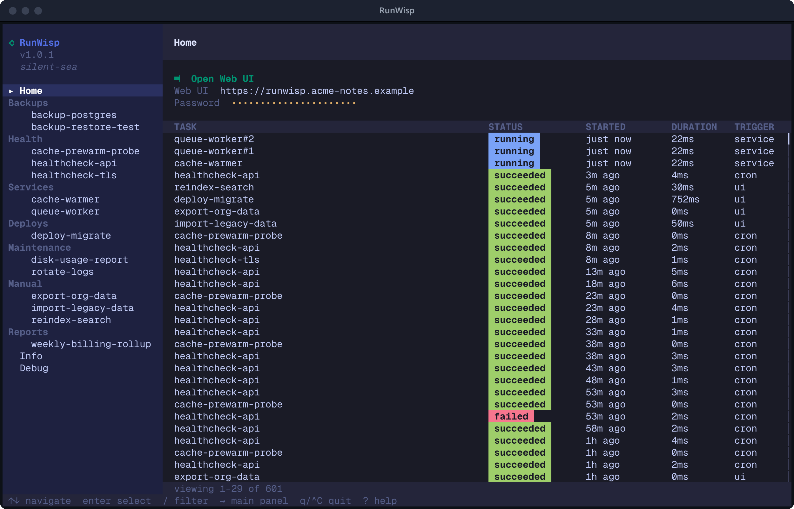

import { CardGrid, LinkCard } from "@astrojs/starlight/components";
import Screenshot from "../../../components/Screenshot.astro";

The Web UI is the same dashboard as the [TUI][tui], in your browser
and updated live as runs happen. It lives **inside the daemon
binary** — no separate web server, no CDN, no extra port. Go to
`http://<host>:<port>` (default `http://localhost:9477`) and you're
there.

[tui]: /getting-started/tui-tour/

The dashboard is small and mostly read-only. The only things that
actually change anything are **trigger, restart, and stop** — the rest
is just looking, because `runwisp.toml` stays the source of truth.

## Open from the TUI

If you're already in the local TUI (just type `runwisp`), the **Open
Web UI** row on the Home page is the easiest way in:

1. `runwisp` starts the daemon and opens the TUI.
2. The Home page lists `▸ ⮕ Open Web UI` as its first row.
3. Press `Enter` and your browser opens the dashboard, already logged
   in — no need to paste the password.

Behind the scenes, the TUI mints a single-use launch ticket and hands
it to the browser, so your password never travels through the URL.

On a server with no browser, the TUI prints the URL instead, so you
can paste it on another machine.

## Open from a browser

When you don't have the local TUI — a remote browser, a coworker's
laptop, a cold bookmark — you'll see the login modal.

<Screenshot
    name="web-ui-login"
    alt="Login modal centred on the dashboard: single password field, Login button, no username."
/>

There's no username — RunWisp is single-operator. Type the password
and submit. The password never goes over the network: login uses a
challenge-response handshake. For details, see [Auth][auth].

[auth]: /operations/auth/

Your session expires after a while, and then you just log in again.
Pile up too many wrong password attempts and you'll hit a temporary
lockout — wait it out or restart the daemon. [Auth][auth] has the exact
limits.

## Overview (`/`)

The landing page after login.

<Screenshot
    name="web-ui-overview"
    alt="Overview page: daemon hero with sparklines, stats cards, task overview tabs (All · Attention · Running · Scheduled · Manual), and the recent activity feed."
/>

- **Daemon header** — a fact bar showing RunWisp name and version,
  host and CPU count, uptime, and the instance fingerprint.
- **Stats** — four summary cards: Healthy tasks, Needs attention,
  Running now, and Recent success rate. CPU and memory show up in
  a separate System resources panel with live sparklines.
- **Task overview** — filter tabs (All · Attention · Running ·
  Scheduled · Manual) with a sort selector, so you see the part you
  care about without scrolling.
- **Recent activity** — the most recent runs across all tasks,
  updated live. Next to it, three side panels (Needs attention,
  Running now, Up next).

## All runs (`/runs`)

A flat, newest-first list of recent runs across every task. This is
the page for "what's been going on lately" when you don't yet know
which task to dig into.

<Screenshot
    name="web-ui-runs"
    alt="All Runs page: flat newest-first table of recent runs across every task with status icons, durations, and timestamps."
/>

### Filtering

The list can get long, so there's a **Filter** button in the run-history
header. It opens a roomy popover _over the run detail_ — so the list
you're filtering stays put and updates live as you tweak it — and on a
phone it slides up as a full-width sheet instead. A badge on the button
counts how many filters are active, and whatever you pick shows up as
removable chips under the header, so you can always see (and clear)
what's narrowing the list.

The filters, roughly in the order you'll reach for them:

- **Status** — five plain-language buckets: **Running**, **Succeeded**,
  **Failed**, **Skipped**, and **Stopped**. Tick **Failed** to catch
  everything that broke or went missing — the one-click answer to "did
  anything fail?". Need to be surgical (say, only `timeout`)? Open
  **Advanced** to pick the exact statuses.
- **Date range** — an independent **From** / **To** pair. Set just one
  end and it stays open the other way — a **From** with no **To** means
  "everything since", and picking the same day for both captures that whole
  day. A bare date counts from its 00:00 (From) or through its end (To),
  so a **To** of 10 July _includes_ everything that ran that day.
- **Task** — narrow to a single task (only on `/runs`; a task's own page
  is already scoped to it).
- **Triggered by** — scheduled (cron), manual (UI or API), a service
  auto-start, or a run on daemon start.
- **Exit code** — a small expression: an exact code (`137`, handy for
  hunting an OOM), a comparison (`>100`, `<=2`), or a window built from
  both (`>100 <150`). It resolves to an inclusive range.
- **Retries** — only runs that were a retry of an earlier attempt.

Everything filters server-side, so the count and "load more" stay
honest no matter how many runs you have. The same filters back the
**bulk actions** (re-run / cancel / delete) — select-all-matching
operates on exactly the rows your filter shows. Over the REST API the
identical knobs are query parameters on
[`GET /api/runs`](/api/) (`status`, `created_after`, `created_before`,
`triggered_by`, `exit_code_min`, `exit_code_max`, `retries_only`).

## Task detail (`/tasks/{id}`)

Click a task in the sidebar (or any run in the activity feed) to open
its detail page. The header names the task and shows its description;
next to it sits the page's one action button — **Run Task** for a
task, **Stop** while a run is active, or for a service
**Stop Service** (or **Restart Service** if the service is currently
stopped).

If the task declares [parameters](/configuration/tasks/#parameters),
clicking **Run Task** opens a form — each declared input renders as a
text field, dropdown, or toggle, with validation and descriptions right
there. Fill in what you need and submit. Tasks with no `params` trigger
instantly with no form.

Underneath the header you'll find the run history
for this task and, taking up most of the pane, the log for whichever
run you have selected. New lines stream in live while the run is
going.

<Screenshot
    name="web-ui-task-detail"
    alt="Task detail for a finished run: header with Run Task button, run history list on the side, log viewer occupying most of the pane."
/>

### The log viewer

When you open a finished run, the log viewer opens at the **end** of
the log and loads earlier content as you scroll up. For a run still
in progress, new lines stream in live. Line numbers match exactly,
so anything you grep for in the file on disk is at the same line
number in the browser. A **Download log** button in the run header
gives you the whole file as a single download.

### Failed runs

Nothing silently fails. A failed run shows up in the same run history
as a successful one, marked with a coloured status pill — `failed`,
`timeout`, `crashed`, `stopped`, `skipped`, or [`log_overflow`](/concepts/logs/#rotation-log_max_size-and-log_on_full) —
alongside its exit code and duration. Click the row to open the run,
and the captured stdout/stderr appears in the same log pane you'd
use for any other run. The Overview page's **Attention** tab gathers
everything that isn't currently healthy so you can spot trouble
without checking each task by hand.

<Screenshot
    name="web-ui-task-failed"
    alt="Task detail for a failed run: red FAILED status pill in the header, exit code next to duration, captured stderr filling the log pane."
/>

## Notifications bell

Top-right of the top bar. The badge shows your unread count.

<Screenshot
    name="web-ui-notifications-popover"
    alt="Bell clicked: popover open with recent notifications, severity dots, relative times, and a coalesced row showing the repeat count."
/>

Click the bell to open a panel with recent notifications, a "View
all" link, and a "Mark all read" button. Each row carries a severity
dot, the event headline, when it happened, and the task name; grouped
rows get a small sparkline showing the rhythm.

The [notifications model][notif] groups duplicate events so a task
that fails over and over doesn't flood your bell — repeats collapse
into one row with a short summary ("12× in the last hour, latest 30s
ago"). Click a notification to open the run it's about.

[notif]: /notifications/model/

### Full notifications page (`/notifications`)

The bell shows a preview. This page shows everything — paginated,
with a "Load more" button. Same row layout, with the unread count at
the top.

<Screenshot
    name="web-ui-notifications-page"
    alt="The full /notifications page: history across all tasks with the unread count at the top."
/>

## What it doesn't do

The Web UI is for watching and controlling, not configuring. You can
trigger, stop, and restart, and you can see everything that's going
on — but `runwisp.toml` is still the source of truth. To change _what_
the daemon does (add a task, tweak a schedule, rename a group, set up a
notifier, scale a service), edit the file and run
[`runwisp reload`](/operations/reload/) (or restart for daemon-wide
settings like `[storage]` or the scheduler timezone).

---

<CardGrid>
    <LinkCard
        title="TUI tour"
        href="/getting-started/tui-tour/"
        description="The same dashboard in your terminal, with keyboard shortcuts."
    />
    <LinkCard
        title="Config overview"
        href="/configuration/overview/"
        description="What to put in the TOML."
    />
    <LinkCard
        title="Operations: auth"
        href="/operations/auth/"
        description="Managing the password and session."
    />
    <LinkCard
        title="Quick start"
        href="/getting-started/quick-start/"
        description="Install RunWisp, scaffold a runwisp.toml, and watch your first task."
    />
</CardGrid>
