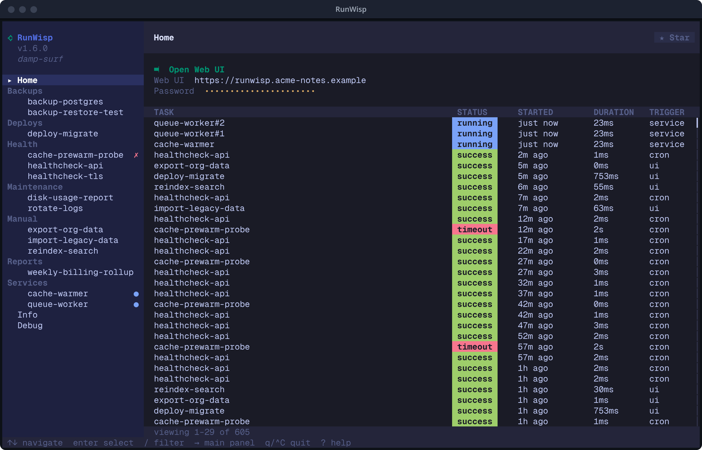

import Screenshot from "../../../components/Screenshot.astro";

The Web UI is built into the daemon. Open `http://<host>:<port>` (by default
`http://localhost:9477`). It updates live as runs happen.

You can run, stop, and restart tasks and services from it. Everything else is
read-only: to change what RunWisp runs, edit `runwisp.toml` and
[reload](/operations/reload/).

## Logging in

From the [TUI](/getting-started/tui-tour/), select **Open Web UI** on the Home
page and press <kbd>Enter</kbd>. Your browser opens already logged in.

From any other browser, you get a login form. There is no username, only the
password.

<Screenshot
    name="web-ui-login"
    alt="Login modal centred on the dashboard: single password field, Login button, no username."
/>

Where the password comes from, session length, and the lockout after too many
wrong attempts are covered in [Authentication](/operations/auth/).

## Overview (`/`)

<Screenshot
    name="web-ui-overview"
    alt="Overview page: daemon hero with sparklines, stats cards, task overview tabs (All · Attention · Running · Scheduled · Manual), and the recent activity feed."
/>

- **Header**: RunWisp version, host, CPU count, uptime, and the instance
  fingerprint.
- **Stats**: healthy tasks, tasks that need attention, running now, and recent
  success rate. A separate panel shows CPU and memory.
- **Task overview**: tabs for All, Attention, Running, Scheduled, and Manual,
  with a sort selector. **Attention** lists everything that isn't healthy. A
  task with a `held` badge comes from a crontab that cron still runs; see
  [Held jobs](/coming-from/cron/#held-jobs). A task whose schedule you paused
  shows as **Paused**, and a service you stopped shows as **Stopped**.
- **Recent activity**: the latest runs across all tasks, next to the Needs
  attention, Running now, and Up next panels.

## All runs (`/runs`)

Recent runs across every task, newest first.

<Screenshot
    name="web-ui-runs"
    alt="All Runs page: flat newest-first table of recent runs across every task with status icons, durations, and timestamps."
/>

### Filtering

Click **Filter** in the run list header. Active filters show as chips under the
header; click one to remove it.

- **Status**: Running, Succeeded, Failed, Skipped, or Stopped. **Failed**
  includes every kind of failure. Open **Advanced** to pick exact statuses, such
  as only `timeout`.
- **Date range**: **From** and **To**, each optional. A date alone covers the
  whole day, so a **To** of 10 July includes runs on 10 July.
- **Task**: only on `/runs`.
- **Triggered by**: schedule, REST API, Web UI or TUI, `runwisp run`, service
  start, or daemon start.
- **Exit code**: an exact code (`137`), a comparison (`>100`, `<=2`), or a range
  (`>100 <150`).
- **Retries**: only runs that retried an earlier attempt.

Select runs to re-run, cancel, or delete them together. "Select all" selects
every run that matches the filter, not only the visible rows. The same filters
are query parameters on [`GET /api/runs`](/api/).

## Task detail (`/tasks/{id}`)

Click a task in the sidebar to open it. The strip at the top says what the
task is doing and what comes next, with the task's actions next to it:

- A cron task shows its schedule and next run, with **Run now** and **Pause**,
  or **Resume schedule** while it is paused (see
  [Pausing a schedule](/concepts/scheduling/#pausing-a-schedule)).
- A service shows how many instances are up. If one gave up, the strip says
  how many times it failed to start and its last exit code. It has
  **Restart** and **Stop service**, or **Start** while instances are down.
- When the last run failed, the strip says so. Click it to open that run.

**Details** shows the task's configuration as written in `runwisp.toml`,
including its `run` command and environment.

Below are the task's run history and the log of the selected run. Each run in
the history has two small bars for its CPU time and memory, red when the run
used much more than the task usually does. The selected run's header has the
actions for that run: **Stop run** while it is running, **Download log**, and
delete. Facts that don't fit on its line move into the ⋯ menu.

Scroll down through a log and the strip folds into the top bar to give the
log more room. Scroll back up, or reach the top of the log, and it comes back.

<Screenshot
    name="web-ui-task-detail"
    alt="Task detail for a finished run: task strip with Run now, run history list on the side, log viewer occupying most of the pane."
/>

If the task has [parameters](/concepts/parameters/), **Run…** opens a form
with one field per parameter.

<Screenshot
    name="web-ui-params"
    alt="Run Task modal for a parameterised task: text fields, dropdowns, a number input, and a toggle, one control per declared parameter, each with help text underneath."
/>

### The log viewer

A finished run opens at the end of its log; scroll up to load earlier lines. A
running run streams new lines live. Line numbers match the log file on disk.
**Download log** in the run header downloads the whole file.

### Failed runs

A failed run has a coloured status (`failed`, `timeout`, `crashed`, `stopped`,
`skipped`, or [`log_overflow`](/concepts/logs/#limiting-log-size)),
its exit code, and its duration. Click it to read its output.

<Screenshot
    name="web-ui-task-failed"
    alt="Task detail for a failed run: red FAILED status pill in the header, exit code next to duration, captured stderr filling the log pane."
/>

## Notifications

The bell in the top bar shows the unread count. Click it for recent
notifications, **Mark all read**, and **View all**. Click a notification to open
its run.

<Screenshot
    name="web-ui-notifications-popover"
    alt="Bell clicked: popover open with recent notifications, severity dots, relative times, and a coalesced row showing the repeat count."
/>

Repeats of the same event are grouped into one row, such as "12× in the last
hour". See [Notifications](/notifications/).

`/notifications` lists all notifications, with **Load more** at the bottom.

<Screenshot
    name="web-ui-notifications-page"
    alt="The full /notifications page: history across all tasks with the unread count at the top."
/>
